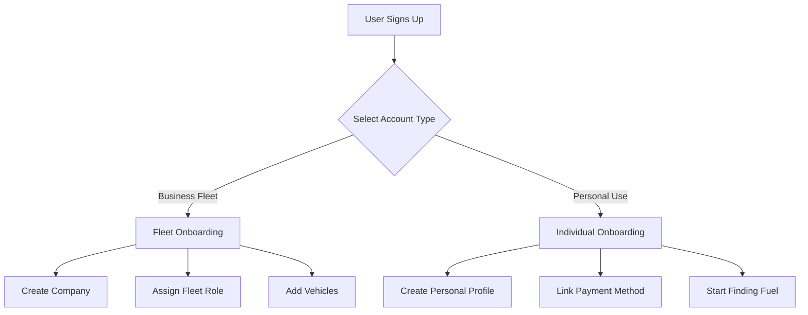

# 🎯 Multi-Tenant Auth System: Fleet (B2B) + Individual (B2C)

## Overview

This system supports **two distinct customer types**:

1. **Fleet Management (B2B)** - Companies like AtoB Fuel managing 10-500+ vehicles
2. **Individual Consumers (B2C)** - Single users like Upside app users

---

## 🏗️ Unified Architecture

```
┌─────────────────────────────────────────────────────────────────┐
│                    MAFUTA FUEL PLATFORM                         │
│                    (Clerk Authentication)                        │
└─────────────────────────────────────────────────────────────────┘
                              │
        ┌─────────────────────┴─────────────────────┐
        │                                            │
        ▼                                            ▼
┌──────────────────┐                      ┌──────────────────┐
│  FLEET (B2B)     │                      │ INDIVIDUAL (B2C) │
│  Multi-Tenant    │                      │  Single User     │
└──────────────────┘                      └──────────────────┘
        │                                            │
        ├─ Companies                                 ├─ Personal Account
        │  └─ Vehicles                              ├─ Personal Cards
        │  └─ Drivers                               ├─ Transactions
        │  └─ Managers                              ├─ Rewards
        │  └─ Transactions                          └─ Stations
        └─ Company Billing
```

---

## 📊 User Type Detection Flow



---

## 🎭 User Types & Roles

### Account Types
- `FLEET` - Business customer (multi-tenant)
- `INDIVIDUAL` - Personal customer (single tenant)

### Fleet Roles (for FLEET accounts)
- `fleet_admin` - Company owner
- `fleet_manager` - Operations manager
- `driver` - Vehicle operator
- `accountant` - Finance/reporting
- `dispatcher` - Route planning

### Individual Roles (for INDIVIDUAL accounts)
- `consumer` - Standard user
- `premium` - Premium subscriber
- `business` - Small business owner with personal account

---

## 🔧 Implementation Plan

**Time Estimate:** 4-6 hours

### Phase 1: Database Schema (1 hour)
### Phase 2: Auth Configuration (1 hour)
### Phase 3: Onboarding Flow (1.5 hours)
### Phase 4: Dashboard Routing (1 hour)
### Phase 5: Permission System (1.5 hours)

---

## ✅ Success Criteria

- [ ] User selects account type during signup
- [ ] Fleet users create/join companies
- [ ] Individual users get personal dashboard
- [ ] Data completely isolated between companies
- [ ] Roles enforce correct permissions
- [ ] Single codebase handles both types
- [ ] Easy to add new account types later

